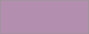
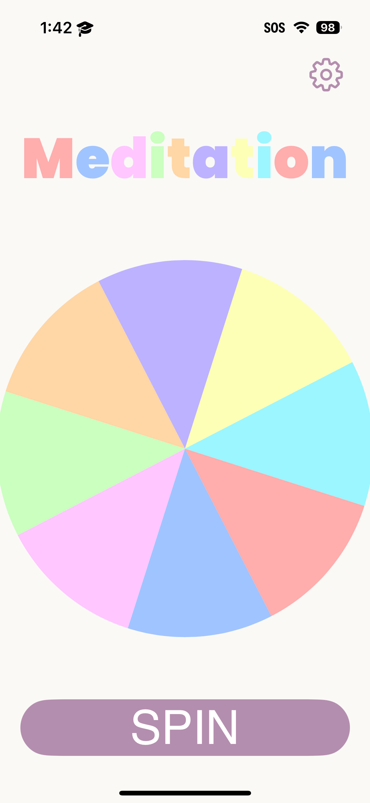
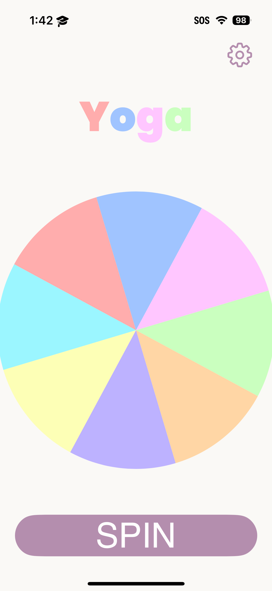

# Serene Spin

A decision making spinner when your anxiety is high and don't feel like making a choice on your own. So introducing Serene Spin a pleasant random spinner app that allows you to do just that with just a tap of the button.

## Background

Serene Spin was created as part of Challenge 1 at the MSU Apple Developer Academy, where are challenge was to simply delight our user who was a individual from the Academy's Renissance program, name Tamera. She simply wanted something that could help her to relive stress in her busy life and that when Serene Spin was born. Created by Team Caddy Lac, Serene Spin set out to allow our user to be able to not have to stress when making decison in everyday life and give her one less thing to have to think about. We wanted our app to also be easy on the eyes, with colorful but not superbright colors as well as very satifying animations and experiences to help the user feel Serene!
## Lessons Learned

This being my first every project i learned a lot from this challenge from learning a few basic fundumentals of Swift as well as learning to build screens using SwiftUI. I also learned a bit about animations when it came to trying to get the wheel to spin properly.
## Acknowledgements

I would like to thank my team Caddy Lac for all being amazing at their jobs, and delighting our user when Challenge 1 was all set and done.

## Authors

- [Davaughn Williams](https://www.github.com/313rdWay)
- Brianna Donald
- Derrick Hines
- Lonzell Black

## Documentation

[Documentation](Documentation/Serene%20Spin%20Usablity%20Test%20copy%202.pages)

## Color Reference

| UI Colors             | Hex                                                                |
| ----------------- | ------------------------------------------------------------------ |
| Example Color |  #B48EAE |
| Example Color |  #F2F0EF |
| Example Color |  #646E68 |

| Wheel Colors             | Hex                                                                |
| ----------------- | ------------------------------------------------------------------ |
| Pastel Lavender |  #BDB2FF |
| Pastel Pink |  #FFC6FF |
| Pastel Red |  #FFADAD |
| Pastel Orange |  #FFD6A5 |
| Pastel Yellow |  #FDFFB6 |
| Pastel Green |  #CAFFBF |
| Pastel Light Blue |  #9BF6FF |
| Pastel Purple |  #A0C4FF |

## Screenshots

